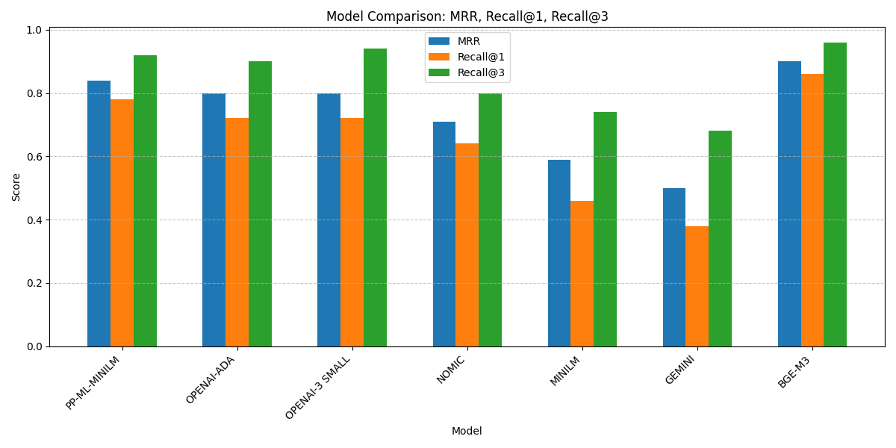
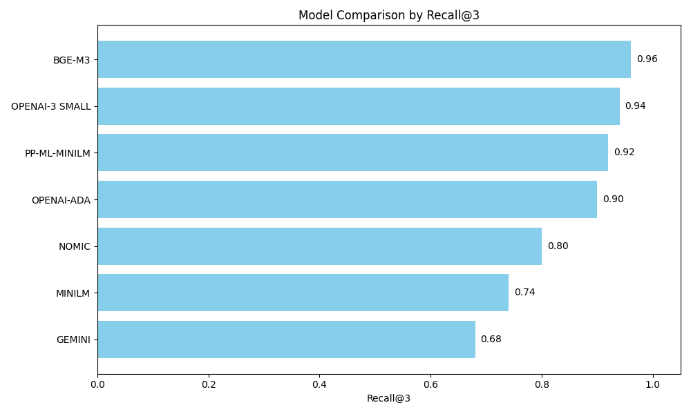

## RAG for Hungarian documents
### Which embedder to use?
- Problem
- Solution
- Retrieval Evaluation  
---
## Problem
- Create a chatbot for the **CleanService** company
- Company data: **Hungarian**
```
## Fizetés
- A fizetés 1800-2000 euró körüli havonta nettó
- Órabér alapján számolódik, gyorsasági prémiumokkal kiegészítve
- A fizetés két részből áll: magyar alapbérből és német elszámolásból, amit egy összegben utalnak a bankszámlára a hónap 15-én
- A vasárnapi és ünnepnapi munkákra 80% pótlék jár
- A német fizetés 2 részből áll: a magyar alapbérből és a német elszámolásból, ami egy összegben 15-én utalódik a saját bankszámlára
- A magyar havi alapbér NEM ELŐLEG, hanem része a német fizetésnek
- Akinek Revolut/TransferWise bankszámlája van, az azonnal megkapja az elutalt fizetést

## Nyelvtudás
- Német nyelvtudás nem szükséges a jelentkezéshez
- A munkához szükséges alapvető kifejezéseket és kommunikációt a cégnél tanítják meg
- Németországban kötelező nyelvoktatást fog kapni, hogy elsajátítsa a legfontosabb, munkához szükséges kifejezéseket
...
```


---
## Solution
- RAG - **Embedder models:**
    1. `PP-ML-MINILM` - ST - **paraphrase-multilingual-MiniLM-L12-v2**
    2. `NOMIC` - Ollama - **nomic-embed-text**
    3. `MINILM` - Ollama - **all-minilm:latest**
    4. `OPENAI-ADA` -OpenAI - **text-embedding-ada-002**
    5. `OPENAI-3 SMALL` -OpenAI - **text-embedding-3-small**
    5. `GEMINI` - Gemini - **embedding-001**
    6. `BGE-M3` - ST - **BAAI/bge-m3**

---
## Retrieval Evaluation

- Vector DB: **FAISS**
- Question set: **50** questions - `data/cs_qa.txt`
- Metrics:
1. `MRR` - Mean Reciprocal Rank
2. `Recall@1`
3. `Recall@3`
---
## Results - Table

| Model         | MRR  | Recall@1 | Recall@3 |
|---------------|------|----------|----------|
| BGE-M3        | 0.90 | 0.86     | 0.96     |
| PP-ML-MINILM  | 0.84 | 0.78     | 0.92     |
| OPENAI-ADA    | 0.80 | 0.72     | 0.90     |
| OPENAI-3 SMALL| 0.80 | 0.72     | 0.94     |
| NOMIC         | 0.71 | 0.64     | 0.80     |
| MINILM        | 0.59 | 0.46     | 0.74     |
| GEMINI        | 0.50 | 0.38     | 0.68     |

---
## Results 
  MRR, Recall@1, Recall@3
   

---
## Results
  Recall@3
   

---
## Best Models
| **Model**         | **Provider**          | **Dim.**  | **Context** |
| ------------------| --------------------- | ----------|--------------|
| **BGE-M3**        | Sentence-Transformers | 1024      | 8192 tokens  |
| **PP‑ML‑MINILM**  | Sentence-Transformers | 384       | 256  tokens  |
| **OPENAI-3SMALL** | OpenAI                | 1536      | 8192 tokens  |

---
## Winner

The `BAAI/bge-m3 model`, developed by **Beijing Academy of Artificial Intelligence (BAAI)**, is a multilingual, multi-task, and multi-vector embedding model designed for high-performance retrieval and semantic search across languages and tasks.

---
## References

- [Massive Text Embeddings Leaderboard](https://huggingface.co/blog/mteb)

- [Harang Peter: Mennyire tudnak magyarul az embedding-ek?, 2025.01.09.](https://medium.com/@harangpeter/mennyire-tudnak-magyarul-az-embedding-ek-8207f2bf5cdc)